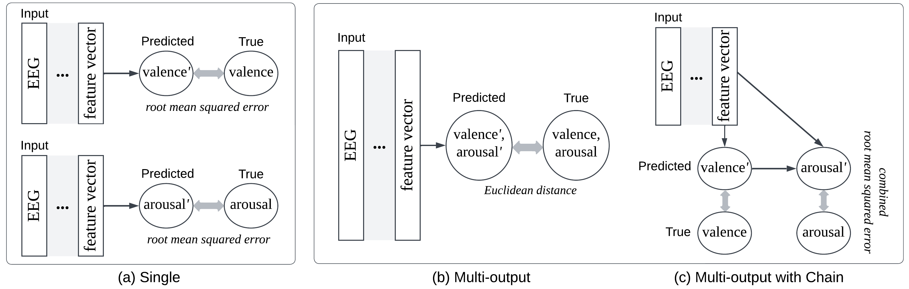
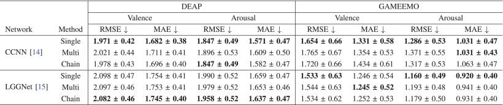

## [Multi-Output Regression for Integrated Prediction of Valence and Arousal in EEG-Based Emotion Recognition](https://doi.org/10.1109/BCI60775.2024.10480527)

This repository contains the code for the _multi-output regression model_ used to predict the correlated dimensions of valence and arousal in EEG-based emotion recognition, aiming to improve prediction accuracy and efficiency. This project is based on the [torcheeg](https://github.com/tczhangzhi/torcheeg) framework.


### Methods



- **Single-output Regression**: Predicts valence and arousal independently.
- **Multi-output Regression**: Predicts valence and arousal simultaneously, considering their interdependencies.
- **Multi-output Regression with Chain Structure**: Predicts valence first and uses it to predict arousal, reflecting the psychological sequence of emotional assessment.


### Datasets and Models

<div style="padding-left: 20px;">

| Datasets                                                                                   | Models                                               |
|--------------------------------------------------------------------------------------------|------------------------------------------------------|
| [DEAP](https://www.eecs.qmul.ac.uk/mmv/datasets/deap/index.html)                           | [CCNN](https://github.com/ynulonger/DE_CNN)          |
| [GAMEEMO](https://www.kaggle.com/datasets/sigfest/database-for-emotion-recognition-system-gameemo/data) | [LGGNet](https://github.com/yi-ding-cs/LGG)          |

</div>

### Results



### Notebooks

- `DEAP_SD.ipynb` : Subject-Dependent project
- `GAMEEMO_SI.ipynb` : Subject-Independent project


### Citation
```
@inproceedings{choi2024multi,
  title={Multi-Output Regression for Integrated Prediction of Valence and Arousal in EEG-Based Emotion Recognition},
  author={Choi, HyoSeon and Woo, ChaeEun and Kong, JiYun and Kim, Byung Hyung},
  booktitle={2024 12th International Winter Conference on Brain-Computer Interface (BCI)},
  pages={1--6},
  year={2024},
  organization={IEEE}
}
```

### LICENSE
This repository has a MIT license, as found in the [LICENSE](./LICENSE) file.

### Contact

For any questions or issues, please contact HyoSeon Choi at 13eye42@inha.edu.
